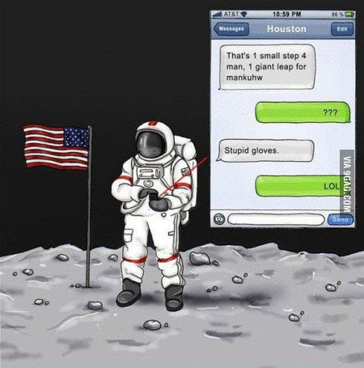

# [CodeQuiz]



Welcome :comet: to my space themed CodeQuiz :telescope:

Here is what the program looks like when you open the webpage :electron:


## How to Use

So you must clone this repository as a zip or directly through terminal 

Once you have downloaded the project then direct it where you stored the file and run:

```
code ..

```

or you can just use the deployment link:[Link text here]

## Functionality 

So instead of creating hide classes and functions to operate on one script file I created seperate files which made it easier for myself and anyone
looking at the code to grasp whats going on :beginner:
The quiz will ominate a red tone if the question is wrong and a green if its correct like this 

there are 6 questions and I also included a rathar hard but intresting bonus question :trollface:
if you get it right kudos to you 


When you are finished you will be directed to the endpage which looks like this 


Then you can input your name and save the score which will then lead you to the highscore page :crown:


## Credits 

This was a difficult project and there was a lot of fuctionality and intertwining concepts that needed to be implemented. So i grabed inspiration from
James Quick who is very skilled on YouTube and was able to explain this in a way that worked for me. Like I stated he used alot of es6 syntax so this is wrote in my interpretation of the way he approached this assignment. As far as style I used my creativity as always and went on my own route for that :octocat:

Link below:

link:[https://www.youtube.com/watch?v=icb9AUBeznQ&t=3302s]